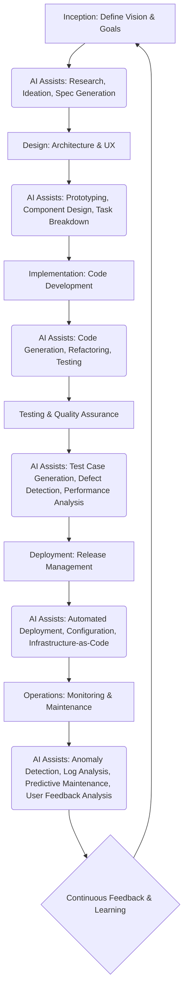
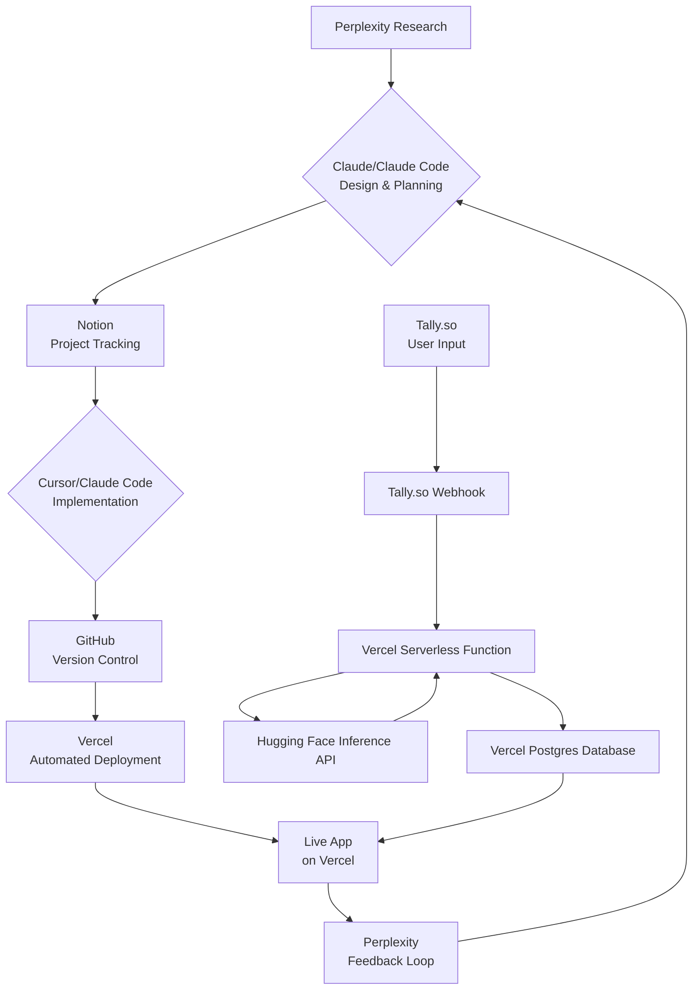

# The AI-DLC Web App Project

This document outlines the plan for building a mobile-friendly, AI-powered web app. The project will fully embrace the AI-Driven Development Lifecycle (AI-DLC) methodology, using a suite of AI tools to enhance every stage of the process, from inception to operations. Documentation, including this file and detailed tracking in Notion, will be a central part of the workflow.

## Project Goals

* **Methodology:** Adopt a modern AI-centric approach to software development (**AI-DLC**).
* **Documentation:** Maintain a comprehensive record of the project's evolution, including AI-driven decisions.
* **Technology Stack:** Use a flexible, non-vendor-locked stack of tools for development, hosting, and AI services.
* **Product:** Build a simple, mobile-friendly **Python web app** hosted on **Vercel**.

## Key Tools

| Category | Tools |
| :--- | :--- |
| **Planning and Design** | Perplexity, Claude, Claude Code, Notion |
| **Development** | Cursor, Claude Code, GitHub, Python|
| **AI Integration** | Hugging Face Serverless Inference API |
| **Hosting** | Vercel, Vercel Postgres (or PlanetScale) |
| **User Input** | Tally.so |
| **Automation** | Tally.so Webhooks (replacing Zapier) |

---

## What is the AI-DLC Process?

The **AI-Driven Development Lifecycle (AI-DLC)** is a modern software development methodology that integrates artificial intelligence as a core collaborator throughout the entire project lifecycle. It goes beyond using AI for simple code generation, instead creating a feedback loop where AI assists in every phase, from generating initial designs to automating testing and maintenance.

### Key Characteristics of AI-DLC:

* **AI as a Collaborator:** AI tools act as intelligent teammates, performing tasks like research, design, coding, and quality assurance.
* **Human Oversight:** The developer remains in control, validating and refining the AI's output.
* **Spec-Driven Development:** AI agents can help convert product specifications into detailed, actionable work plans, often documented in Markdown.
* **Continuous Learning:** AI assists in gathering user feedback and analyzing production data, feeding insights back into the development cycle for continuous improvement.

---

### General flow of the process

## Project Plan: The AI-DLC Workflow

### Phase 1: Planning and Design (Inception)

This phase uses AI to generate and refine the initial product vision, architecture, and user experience, which are all documented in Notion.

1.  **Generate Initial Concept:** Use **Perplexity** to research your app idea, competitors, and user needs. Log the research and insights into your Notion tracker.
2.  **Create Architectural Blueprint:** Use **Claude** (the conversational AI) to draft a project architecture and define features based on the Perplexity research. This blueprint is then added to Notion.
3.  **Define Work Plans:** Leverage **Claude Code** to break down the architectural blueprint into actionable, atomic coding tasks. These tasks are added as individual work items to your Notion database.
4.  **Human Validation (Mob Elaboration):** Review the AI-generated architecture and work plans in Notion. Mark the work items as "**Mob Elaboration**" when they have been validated.

---

### Phase 2: Implementation and Construction (Execution)

This phase uses AI as a primary tool to generate, test, and refine the codebase under human oversight.

1.  **AI-First Coding:** Use **Cursor** as your IDE. Prompt its chat to generate boilerplate code for your FastAPI or Flask app, including the webhook endpoint and database connection logic.
2.  **Execute Complex Tasks (Mob Construction):** Use **Claude Code** within Cursor's terminal to perform specific coding tasks. Examples include:
    * Writing the function to securely handle Tally.so webhook requests.
    * Generating comprehensive test suites for your API endpoints.
3.  **Develop the Vercel Function:** Create the Python serverless function on **Vercel** that will:
    * Receive and verify webhooks from **Tally.so**.
    * Call the **Hugging Face Serverless Inference API** with user input.
    * Save the LLM's response to your **Vercel Postgres** database.
4.  **Create Frontend:** Use Cursor to generate the mobile-friendly frontend code that fetches and displays the AI-generated results.
5.  **GitHub and Secrets:** Push your code to **GitHub**. Add API keys and secrets to both GitHub's and Vercel's secret managers.
6.  **Human Validation and Testing:** Review and test all AI-generated code. Run tests with the assistance of Claude Code.

---

### Phase 3: Deployment and Operations (Scaling)

In this phase, AI automates the deployment process and assists in monitoring and maintenance.

1.  **Configure Webhook:** Set up the webhook in your **Tally.so** form to point to the URL of your Vercel serverless function, including the necessary secret for verification.
2.  **Automated Deployment:** Push code changes to **GitHub** to trigger **Vercel's** automatic build and deployment pipeline.
3.  **Continuous Feedback Loop:**
    * Use **Perplexity** for ongoing market research and monitoring of user feedback.
    * Use **Claude Code** to help write scripts for maintenance and analyzing Vercel logs.
4.  **Track in Notion:** Use your Notion database to update the status of work items to "**Operations**," create new items for feedback, and use the timeline view to visualize release cycles.

---

## Process Flow Visual

Configure access to the AI tools (Claude, Perplexity, Cursor) and development environments (Vercel, GitHub).
Follow the AI-DLC plan, using the tools to guide each phase of development.

